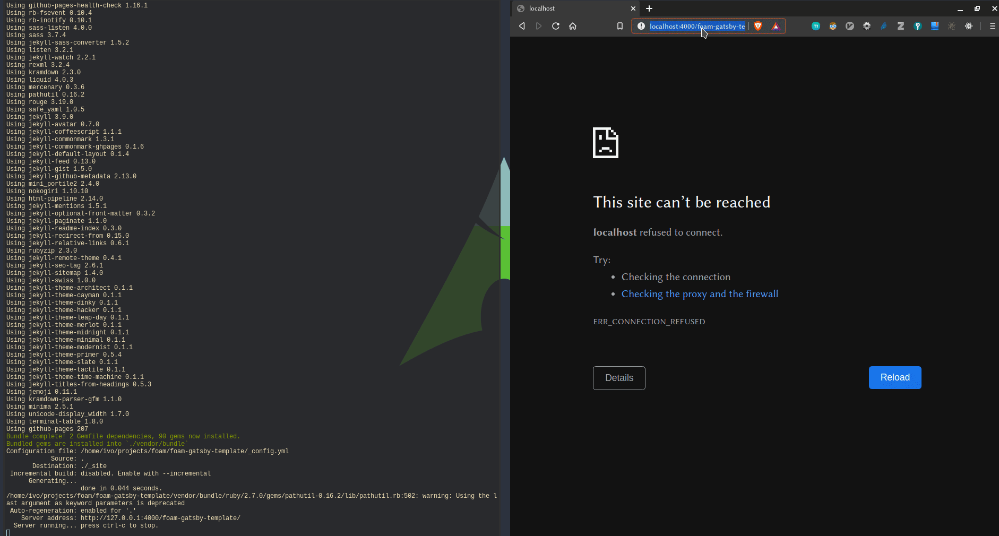

# How to deploy your foam locally (using jekyll)

Recipe for building your GitHub Pages site locally to preview and test changes to your site.

! **Disclaimer**: This Recipe is more suited for "tech savy" foam users since it requires the usage of the command line.

# Prerequisites
- Install [Jekyll](https://jekyllrb.com/docs/installation/)

    Github [recommends](https://docs.github.com/en/github/working-with-github-pages/testing-your-github-pages-site-locally-with-jekyll) using Bundler to install and run Jekyll. Bundler manages Ruby gem dependencies, reduces Jekyll build errors, and prevents environment-related bugs. 
    
    To install Bundler:

    - Install Ruby (https://www.ruby-lang.org/en/documentation/installation/)
    - Install Bundler: `gem install bundler`

# Instructions
- Open the command line
- Navigate into your foam folder
- Switch to the github pages branch (if you do not have one create it):
    - switch: `git checkout gh-pages`
    - create: `git checkout -b gh-pages`
- Initialize Bundler: `bundle init`
- Configure Bundler install path ([optional](https://jekyllrb.com/tutorials/using-jekyll-with-bundler/#configure-bundler-install-path)): `bundle config set --local path 'vendor/bundle'`
- Add to the Gemfile:
    ```
    gem "jekyll"
    gem "github-pages"
    ```
- Install all necessary gems: `bundle install`
- Get a jekyll config file [here](https://jekyllrb.com/docs/configuration/default/)
- In the jekyll config set `baseurl` to your foam folder name
- FINALLY build and serve your pages: `bundle exec jekyll serve`
- Enjoy your local foam deploy on: http://localhost:4000/your-folder-name/ (do not forget the trailing '/')

# TL;DR
```
git clone https://github.com/IvoLeist/foam-gatsby-template.git
cd foam-gatsby-template
git checkout jekyll
bundle install
bundle exec jekyll serve
```



## How to contribute

You can add [[recipes]] by creating a pull request to [foambubble/foam](https://github.com/foambubble/foam) on GitHub.

Read more in our [[contribution-guide]]. 

[//begin]: # "Autogenerated link references for markdown compatibility"
[recommended-extensions]: recommended-extensions "Recommended Extensions"
[recipes]: recipes "Recipes"
[contribution-guide]: contribution-guide "Contribution Guide"
[//end]: # "Autogenerated link references"